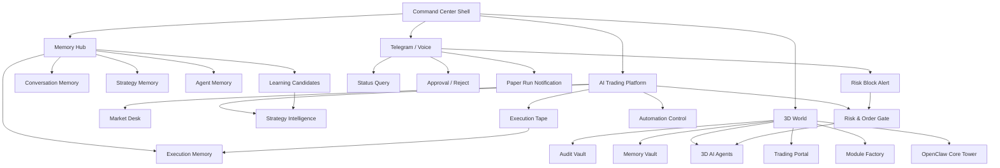
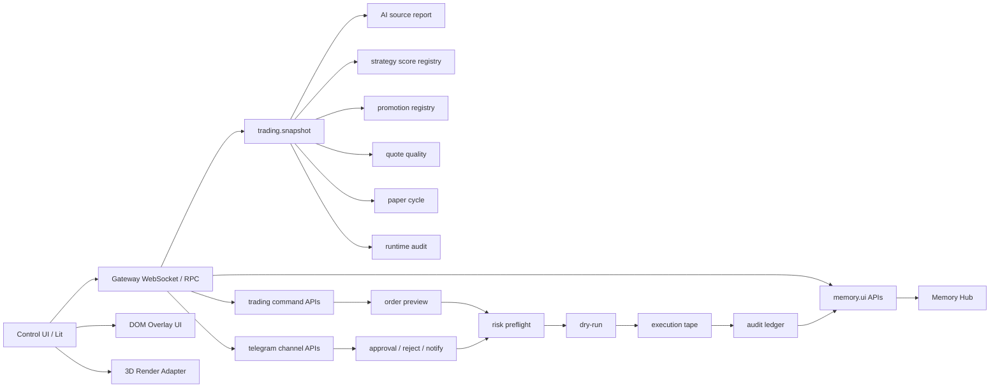
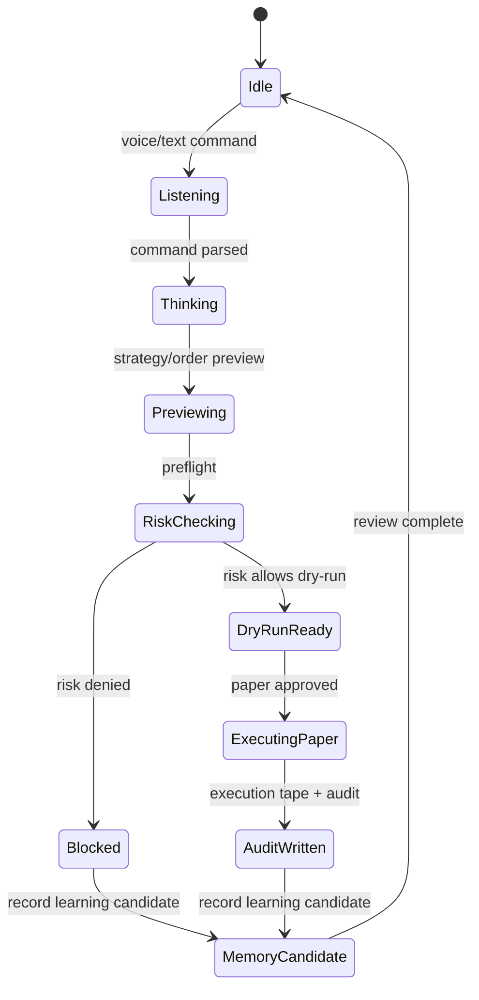
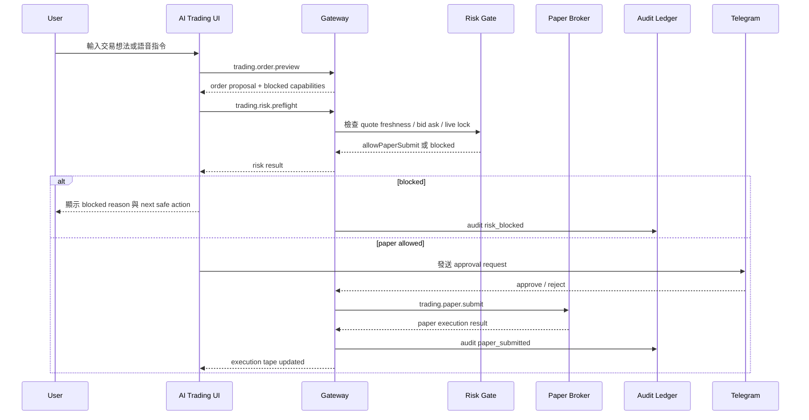

# OpenClaw AI Trading Command Center

## 自動化需求原文

> 將我這互動式網站將前後端的連結都完美規劃完成，依據還有甚麼能優化，還有甚麼功能，能如互動，能如何簡潔實用。還有介面要如何配置才能更加可以互動性，還有我的AI交易平台要如何設置，有甚麼平台能學習，圖表要如何顯示才正確。自動化不斷往最好，最推薦，再次優化。去規劃，自動化不得刪除，如有停止請直接依據最推薦規畫進行，這段文字也要直接複製貼上，然後進行至規劃方案完整。要將你原先規劃的加入，有相同的就留最好的。把這個.md完成

## 核心結論

OpenClaw 最需要的 AI 交易平台介面不是一般交易所 UI，也不是單純 3D 展示，而是 **Strategy Intelligence Trading Desk**。

最推薦架構：

- `Trading Desk`：行情、K 線、order book、成交流、部位、PnL。
- `Strategy Intelligence`：策略分數、回測、promotion queue、blocked reason、learning status。
- `Risk & Order Gate`：所有交易意圖必須先 preview、dry-run、risk preflight。
- `Execution Tape`：完整記錄 proposal、dry-run、blocked、paper submitted、audit written。
- `3D AI Factory`：顯示 AI agent、策略工廠、風控節點、紙交易執行狀態。
- `Telegram / Voice`：只作為指令與審批入口，不可繞過風控。

V1 預設 `paper-first`。真實交易、broker write、exchange API write、資金操作全部鎖定。

## 完美呈現總覽

這份規劃最後要呈現成一個可被理解、可被展示、可被拆工的 UI 產品藍圖。第一眼不是看到密密麻麻的規格，而是先看到三個主世界如何運作。

```text
OpenClaw 3D AI Command Center
  ├─ 3D World：看 OpenClaw 世界、3D 人物、模組、任務、語音互動
  ├─ AI Trading Platform：看策略、自動交易、圖表、風控、paper execution
  └─ Memory Hub：看記憶、學習、歷史、錯誤、策略演化
```

呈現順序固定：

1. 先展示 `3D World`，讓使用者感覺進入 OpenClaw 的 AI 世界。
2. 再從 `Trading Portal` 進入 `AI Trading Platform`，展示專業交易與自動策略樞紐。
3. 再從 `Memory Vault` 進入 `Memory Hub`，展示 OpenClaw 如何記住、學習、避免重複錯誤。
4. 最後展示三區同步：交易事件更新 3D 人物，memory 可以跳回相關 agent 或策略。

## 展示腳本

### Demo 1: 進入 3D World

使用者看到：

- 中央 `OpenClaw Core Tower`。
- 周圍有 Agent、Module Factory、Telegram Tower、Audit Vault、Memory Vault、Trading Portal。
- `Jarvis Core` 以 3D 人物或全息投影顯示。
- 頂部只有簡潔狀態列：Gateway、paper mode、live locked、quote freshness。

互動：

- 使用者說：「Jarvis，現在 OpenClaw 狀態如何？」
- Jarvis 人物轉向使用者，短句回覆。
- 右側 Inspector 顯示完整狀態。

### Demo 2: 點擊 3D 人物

使用者點 `Risk Officer`。

畫面反應：

- 鏡頭聚焦 Risk Fortress。
- Risk Officer 顯示紅/黃/綠狀態。
- 右側 Inspector 切到 Risk tab。
- 顯示 quote stale、invalid bid/ask、live locked、broker write disabled。

### Demo 3: 進入 AI Trading Platform

使用者點 `Trading Portal`。

畫面切換：

- 左側 Market Universe。
- 中央 Trading Desk。
- 右側 Strategy / Risk Inspector。
- 底部 Execution Tape。
- 上方 Trading Command Bar。

使用者說：「用 TXF 最強策略做 dry-run。」

流程：

```text
command preview
  -> strategy preview
  -> risk preflight
  -> dry-run
  -> execution tape
  -> audit trace
```

### Demo 4: 進入 Memory Hub

使用者點 `Memory Vault` 或說：「打開這個策略的記憶。」

畫面切換：

- 左側 Memory Types。
- 中央 Memory Timeline。
- 右側 Memory Detail。

可看到：

- 策略曾經被 blocked 的原因。
- paper execution 成功/失敗紀錄。
- Agent 最近任務。
- 使用者偏好。
- AI 平台學習卡。

### Demo 5: 三區同步

使用者在 AI Trading Platform 觸發 quote stale blocked。

同步反應：

- Execution Tape 新增 `risk_blocked`。
- 3D World 的 Market Scout 與 Risk Officer 變紅。
- Memory Hub 產生 `learning candidate`。
- Telegram Operator 可推送狀態通知。

## 視覺語言

整體視覺要像專業 AI 作戰艙，不像普通 SaaS dashboard。

材料語言：

- 3D 世界：深色金屬、玻璃、全息投影、資料光線。
- 交易平台：高密度但清楚的專業交易終端。
- 記憶中心：資料庫、檔案庫、時間軸、知識圖譜感。

色彩規則：

- 背景：碳黑、深藍黑。
- 正常：綠。
- 執行中：冷青藍。
- 警告：琥珀黃。
- 阻擋：紅。
- 鎖定：灰。
- 記憶/學習：金色或暖白，不與風控紅黃綠混淆。

資訊密度：

- 3D World：低密度，保護視野。
- AI Trading Platform：中高密度，交易資料清楚分層。
- Memory Hub：中密度，重點是搜尋、來源、時間、confidence。

動效規則：

- 狀態變化才動畫。
- Agent 回應、風控阻擋、paper submitted、audit written 才有明顯動效。
- 不做無意義霓虹閃爍。
- 開抽屜時暫停或限制 3D camera input，避免 UI 與鏡頭互搶。

## 最終展示版資訊架構圖

這個 UI 最終要用「三層主舞台」呈現，避免所有功能擠在同一頁。



設計原則：

- `3D World` 負責理解 OpenClaw 正在做什麼。
- `AI Trading Platform` 負責交易決策、策略啟動、風控與 paper execution。
- `Memory Hub` 負責長期學習、對話記憶、錯誤避免與策略演化。
- `Telegram / Voice` 是入口與通知層，不能繞過 `Risk & Order Gate`。

## 3D World 版面建築圖

3D 世界不是裝飾背景，而是 OpenClaw 的「可視化作業地圖」。

```text
┌────────────────────────────────────────────────────────────────────┐
│ Top Status Strip                                                    │
│ Gateway: online | Paper: on | Live: locked | Quote: stale/ok        │
├───────────────┬──────────────────────────────────────┬─────────────┤
│ World Menu    │ 3D Scene                              │ Inspector   │
│               │                                      │             │
│ - World       │        [OpenClaw Core Tower]          │ Selected:   │
│ - Trading     │               │                      │ Risk Officer│
│ - Memory      │   [Agent Ring / Module Factory]       │ Status      │
│ - Audit       │               │                      │ Trace       │
│ - Settings    │ [Telegram Tower] [Trading Portal]     │ Actions     │
│               │ [Memory Vault] [Audit Vault]          │             │
├───────────────┴──────────────────────────────────────┴─────────────┤
│ Command Dock: voice / text command / quick actions / latest event   │
└────────────────────────────────────────────────────────────────────┘
```

Persistent HUD 只能保留：

- 上方狀態列。
- 左側小型世界選單。
- 右側 Inspector，只有點擊或語音查詢後展開。
- 下方 Command Dock。

3D 場景中心不能塞滿卡片，否則互動世界會變成普通 dashboard。

## 3D 世界物件對應表

| 3D 物件 | 顯示內容 | 點擊後開啟 | 狀態來源 | V1 狀態 |
| --- | --- | --- | --- | --- |
| `OpenClaw Core Tower` | gateway、runtime、module health | System Inspector | gateway snapshot | read-only |
| `Jarvis Core` | AI 總管、語音回覆、任務導覽 | Command Inspector | command runtime | preview |
| `Market Scout` | quote quality、市場掃描 | Market Inspector | quote adapter | read-only |
| `Strategy Builder` | strategy score、promotion queue | Strategy Inspector | strategy registry | read-only |
| `Risk Officer` | risk blocked、live locked、preflight result | Risk Inspector | risk gate | preview / dry-run |
| `Paper Broker` | paper cycle、paper order、paper PnL | Execution Inspector | paper latest cycle | paper-only |
| `Telegram Operator` | Telegram status、approval queue | Telegram Inspector | Telegram channel | status / approval |
| `Memory Vault` | conversation、strategy、agent、audit memory | Memory Hub | memory adapter | read-only / review |
| `Audit Vault` | trace、event、dry-run、paper execution | Audit Inspector | audit ledger | read-only |
| `Trading Portal` | 進入交易平台 | AI Trading Platform | UI route | navigation |

## AI Trading Platform 版面建築圖

AI 交易平台要獨立成一個主版面，因為它是高密度操作區，不應塞在 3D 世界裡。

```text
┌──────────────────────────────────────────────────────────────────────────────┐
│ Trading Command Bar                                                         │
│ "用 TXF 最強策略做 dry-run"  [Preview] [Risk Check] [Paper Run] [Locked Live]│
├──────────────┬──────────────────────────────────────────┬───────────────────┤
│ Market       │ Chart & Trading Desk                     │ Strategy / Risk   │
│ Universe     │                                          │ Inspector         │
│              │ ┌──────────────────────────────────────┐ │                   │
│ - TXF        │ │ K line / volume / signal overlay      │ │ Strategy Score    │
│ - BTCUSDT    │ └──────────────────────────────────────┘ │ Backtest          │
│ - US equities│ ┌──────────────────┬──────────────────┐ │ Promotion Queue   │
│ - Watchlist  │ │ Order Book       │ Position / PnL    │ │ Risk Preflight    │
│              │ └──────────────────┴──────────────────┘ │ Blocked Reason    │
├──────────────┴──────────────────────────────────────────┴───────────────────┤
│ Execution Tape: command -> proposal -> preflight -> dry-run -> audit         │
└──────────────────────────────────────────────────────────────────────────────┘
```

這個頁面最重要的不是好看，而是每一個交易動作都能回答四個問題：

- 這個策略為什麼被選中？
- 現在資料是否新鮮且可信？
- 風控允許到哪一步？
- 這次操作的 trace / audit 在哪裡？

## Memory Hub 版面建築圖

Memory Hub 要獨立成「記憶區域」，不是把記憶塞到聊天紀錄。

```text
┌────────────────────────────────────────────────────────────────────┐
│ Memory Search: strategy / agent / trace / command / error / source │
├─────────────────┬──────────────────────────────────┬───────────────┤
│ Memory Types    │ Timeline / Knowledge Graph        │ Memory Detail │
│                 │                                  │               │
│ Conversation    │ 2026-05-06 UI decision            │ Source        │
│ Strategy        │ 2026-05-06 risk blocked           │ Confidence    │
│ Agent           │ 2026-05-05 dry-run success        │ Related Trace │
│ Execution       │ 2026-05-05 audit written          │ Use In UI     │
│ Platform        │ vectorbt / Qlib / OpenBB cards    │ Promote Gate  │
│ Error           │ stale quote / invalid preflight   │               │
├─────────────────┴──────────────────────────────────┴───────────────┤
│ Related Actions: open strategy | open agent | open trace | create review     │
└────────────────────────────────────────────────────────────────────┘
```

Memory Hub 的 V1 規則：

- 可以搜尋、引用、關聯、顯示 confidence。
- 可以產生 learning candidate。
- 不能自動覆寫 durable memory。
- promotion 必須經 review gate。
- 每筆記憶都要有 source、traceId、createdAt、confidence、status。

## 前後端運行建築圖

V1 不建立第二套 OpenClaw。UI 仍然走既有 Control UI + Gateway。



資料流約束：

- 前端不能直接讀散落檔案。
- 前端只能吃 Gateway 統一後的 snapshot / RPC payload。
- 3D scene 只吃 normalized state，不直接碰交易邏輯。
- 交易命令一定先 preview，再 risk preflight，再 dry-run 或 paper。
- Telegram / Voice 都走同一條 command pipeline。

## 3D 互動狀態機

3D 人物不是只站著，它要反映 OpenClaw 狀態。



狀態顯示方式：

| 狀態 | 3D 表現 | UI 表現 | 是否可操作 |
| --- | --- | --- | --- |
| `Idle` | 人物待命、低亮度呼吸光 | Command Dock ready | 可以查詢 |
| `Listening` | 人物轉向使用者、麥克風光圈 | 語音/文字輸入 active | 可以取消 |
| `Thinking` | 頭部或全息核心閃爍 | Parsing command | 不可重送 |
| `Previewing` | Strategy Builder 發光 | proposal panel | 可查看 |
| `RiskChecking` | Risk Officer 啟動掃描 | preflight panel | 等待結果 |
| `Blocked` | 風控紅色屏障 | blocked reason | 不能執行 |
| `DryRunReady` | Paper Broker 亮起 | dry-run CTA | 可 dry-run |
| `ExecutingPaper` | paper execution path 發光 | execution tape running | 不可重送 |
| `AuditWritten` | Audit Vault 收束光線 | auditId 顯示 | 可開 audit |
| `MemoryCandidate` | Memory Vault 產生節點 | learning candidate | 可送 review |

## 完美呈現驗收順序

要讓規劃真正「完整」，驗收順序不能從工程細節開始，要從產品體驗開始。

1. `Can Understand`：使用者 10 秒內知道這是 OpenClaw 3D AI Command Center。
2. `Can Navigate`：使用者能從 3D World 進入 AI Trading Platform 與 Memory Hub。
3. `Can Inspect`：使用者能點擊任一 3D 人物或模組看狀態來源。
4. `Can Command`：使用者能用文字/語音送出 preview / dry-run 指令。
5. `Can Trust`：每個交易動作都有 risk result、blocked reason、traceId、auditId。
6. `Can Learn`：每次 blocked / success / failure 都能進 Memory Hub 成為 learning candidate。
7. `Can Notify`：Telegram 可以查狀態、收風控阻擋、做 paper approval。
8. `Can Stay Safe`：live trading、broker write、exchange write 永遠鎖定到明確授權版本。

## 設計交付包格式

這份 `.md` 後續可直接拆成四種交付物：

| 交付物 | 用途 | 來源章節 |
| --- | --- | --- |
| `Product Brief` | 說明這是什麼產品 | 核心結論、產品定位、完美呈現總覽 |
| `UX Blueprint` | 說明每個畫面怎麼配置 | 3D World、AI Trading、Memory Hub 版面建築圖 |
| `Engineering Spec` | 說明前後端怎麼接 | 前後端運行建築圖、Trading UI Contract、API Payload |
| `Validation Plan` | 說明怎樣才算完成 | 完美呈現驗收順序、V1 驗收矩陣、驗證標準 |

最終設計稿可以依這四包輸出，不需要重新發明資訊架構。

## 一頁式工程總表

| Area | 最推薦決策 | V1 做法 | V1 不做 |
| --- | --- | --- | --- |
| 產品型態 | AI 交易作戰室 | `AI Trading` tab | 第二套 OpenClaw |
| 前端框架 | 沿用 Control UI | Lit + Gateway snapshot | React 重寫 |
| 3D | 狀態視覺化 | Agent / risk / execution 狀態 | 交易圖表塞進 3D |
| 後端 | Gateway 統一資料契約 | `trading.snapshot` adapter | UI 直讀散落檔案 |
| 交易模式 | paper-first | preview / dry-run / paper gated | live trading |
| AI 能力 | 建議與解釋 | proposal / blocked reason / next action | 直接下單 |
| 圖表 | 可追溯正確顯示 | K 線、order book、回測、PnL 分層 | 混成一張雜圖 |
| Telegram | 審批與狀態同步 | approve / reject / status | 繞過 risk gate |
| 語音 | 指令入口 | 查詢、preview、dry-run | submit |
| 稽核 | 全鏈路 trace | traceId 到 auditId | 無追溯操作 |

## 階段路線圖

### Phase 0: 文件鎖定

交付：

- 本文件作為唯一規劃來源。
- 不再新增平行 UI 方案。
- 後續任務都依 `Trading UI Contract` 拆分。

成功標準：

- 工程實作者能從本文件直接開始 Task 1。
- 不需要再決定產品定位、UI 結構、資料流或安全邊界。

### Phase 1: Read-only Intelligence

交付：

- `trading.snapshot`。
- AI source cards。
- strategy score。
- promotion queue。
- quote quality。
- paper latest cycle。

成功標準：

- 只讀畫面可呈現 OpenClaw 已學習平台與策略狀態。
- 所有 blocked / stale / locked 狀態正確顯示。

### Phase 2: Command Preview

交付：

- Command Bar。
- `trading.order.preview`。
- `trading.risk.preflight`。
- blocked command response。

成功標準：

- AI 指令只會產生 proposal。
- live / broker write / skip approval 指令都被阻擋。

### Phase 3: Paper Execution Loop

交付：

- paper approval gate。
- `trading.paper.submit`。
- Execution Tape。
- Audit Ledger trace。

成功標準：

- 只有通過 risk gate 的 proposal 可進 paper submit。
- 每筆 paper action 都有 traceId 與 auditId。

### Phase 4: 3D AI Factory

交付：

- 3D agent overlay。
- agent 點擊細節抽屜。
- strategy / risk / execution 狀態同步。

成功標準：

- 3D 可以快速看懂哪個 Agent 在工作、哪個策略被阻擋、哪個風控節點出問題。
- 3D 不承擔交易數字密集顯示。

### Phase 5: Telegram / Voice Sync

交付：

- Telegram status / approval。
- Voice command preview。
- 多入口共用 command broker。

成功標準：

- UI、Telegram、語音三者結果一致。
- 任一入口都不能繞過 dry-run、risk gate、approval。

## 決策完整版總覽

最終採用單一產品線：`AI Trading Command Center`。

不再分散成多套 UI：

- 不做獨立 3D 網站。
- 不做第二個 OpenClaw 專案。
- 不做純 dashboard。
- 不做 live bot 控制台。
- 不做交易所複製版。

採用單一主路徑：

```text
User intent
  -> Command Bar
  -> Gateway command preview
  -> Trading UI Contract
  -> Risk Gate
  -> Paper Execution
  -> Audit Ledger
  -> 3D Factory state update
```

所有介面都要回答 6 個問題：

- `現在市場能不能看`：quote quality。
- `哪個策略最值得研究`：strategy score。
- `哪個策略可以 paper`：promotion queue。
- `為什麼不能執行`：blocked reason。
- `OpenClaw 做了什麼`：execution tape。
- `下一步最安全是什麼`：next safe action。

## 對話記憶與 UI 決策層

這一段是本輪對話的固定記憶，後續 UI 規劃與實作不得回到已被修正的錯誤方向。

### 已定案的產品方向

- 這不是一般 dashboard，也不是傳統交易所複製版。
- 這不是單純 3D 背景，也不是 2D 面板旁邊加一個裝飾性 3D 模型。
- 這要做成完整的 `3D OpenClaw World + AI Trading Platform` 雙版面。
- `3D OpenClaw World` 是完整 3D 世界，包含 3D 人物、場景、語音互動、點擊互動、OpenClaw 狀態、任務、模組、Telegram、Audit、Memory。
- `AI Trading Platform` 是獨立交易版面，包含 Trading Desk、Strategy Hub、Automation Control、Risk Gate、Execution Tape、Learning Center、Audit Trace。
- 兩個版面共用 Gateway、command broker、risk gate、audit ledger、memory/learning state，不做兩套 runtime。

### 已定案的 3D World

- 3D 世界要像可操作的 OpenClaw AI 工廠，不是背景動畫。
- 世界中要有 `OpenClaw Core Tower`、`Agent District`、`Module Factory`、`Deployment Bay`、`Telegram Tower`、`Audit Vault`、`Memory Vault`、`Trading Portal`。
- 3D 人物要能點擊、被語音詢問、顯示任務狀態、根據 Gateway 狀態變色。
- 3D 人物至少包含 `Jarvis Core`、`Market Scout`、`Strategy Builder`、`Risk Officer`、`Paper Broker`、`Auditor`、`Telegram Operator`。
- 點擊 `Trading Portal` 進入 AI Trading Platform。
- 點擊 `Memory Vault` 進入記憶與學習中心。
- 點擊 `Audit Vault` 顯示 trace、audit、execution history。
- 語音互動要像「對人物說話」，例如詢問 Risk Officer 為什麼 blocked，詢問 Strategy Builder 哪個策略最強。

### 已定案的 AI Trading Platform

- AI Trading Platform 必須是獨立版面，不塞在 3D World 主畫面。
- AI Trading Platform 不只是看圖表，而是自動交易與策略調用樞紐。
- 平台要能管理策略清單、策略分數、回測、promotion/demotion、blocked reason、paper automation、pause/resume、schedule/event trigger、Telegram control。
- V1 只允許 preview、dry-run、paper-first。
- AI 可以提出 proposal、解釋市場、比較策略、查 blocked reason，但不能直接下單。
- 真實交易、broker write、exchange write、secret access、資金操作全部鎖定。
- 所有策略自動交易必須進 `strategy.preview -> risk.preflight -> dry-run -> approval -> paper automation run -> execution tape -> learning registry`。

### 已定案的記憶層

- UI 必須包含記憶，而不是只顯示即時狀態。
- 記憶層要包含 `Operator Memory`、`Strategy Memory`、`Agent Memory`、`Execution Memory`、`Platform Learning Memory`。
- 3D World 中要有 `Memory Vault`。
- AI Trading Platform 中要有 `Learning / Memory Center`。
- 右側 Inspector 要有 `Memory` tab。
- Execution Tape 每筆事件都要能連到 audit record 與 learning note。
- 交易記憶不可直接解鎖 live，只能作為風控、回測、promotion review 的參考。
- 沒有 traceId / auditId 的記憶只能顯示為 research reference，不可作為 executable trading signal。

### 已定案的互動入口

- 文字、語音、Telegram、3D 點擊都要共用 Gateway command broker。
- 任一入口都不能繞過 dry-run、risk preflight、approval gate。
- 3D 點擊預設只打開 Inspector、聚焦場景、查資料或產生 preview，不可直接 submit。
- 語音可以查狀態、查 blocked reason、要求 dry-run、查 paper cycle，不可直接 submit。
- Telegram 可以查狀態、approve/reject、pause/resume paper automation，但不可繞過 risk gate。

### 已定案的圖表規則

- K 線、order book、backtest、PnL 不塞進 3D 世界。
- 交易圖表放在 AI Trading Platform 的 Trading Desk。
- K 線只放價格、策略訊號、entry/exit marker、stale quote。
- Order book 只放 bid、ask、spread，bid/ask invalid 直接 blocked。
- Backtest matrix 必須同時顯示 win rate、profit factor、max drawdown、sample size。
- Strategy score chart 必須顯示 score band、runtime health、promotion status、blocked reason。
- 無 auditId 的訊號只能顯示為 research signal，不可顯示為 executable signal。

### 已定案的學習平台映射

- `OpenBB` 只吸收市場研究 terminal 與資料源邊界。
- `vectorbt / backtrader` 只吸收回測與策略比較。
- `Qlib / FinRL` 只吸收 AI quant / RL 研究與 paper-only learning。
- `FinRobot` 只吸收金融 agent 分析與風險解釋。
- `QuantConnect Lean / NautilusTrader` 只吸收事件驅動策略生命週期。
- `Freqtrade / Hummingbot / vn.py / Jesse / OctoBot / Superalgos` 只顯示 blocked reference，不安裝、不執行、不下單。

### 已否決的方向

- 否決：把所有功能塞在單一 3D 畫面。
- 否決：把 AI Trading 當成 3D World 的小面板。
- 否決：只做狀態 dashboard。
- 否決：只做漂亮 3D 場景但沒有 Gateway contract。
- 否決：讓 UI、語音、Telegram 各自維護狀態。
- 否決：讓 AI command 直接 submit。
- 否決：用 live bot 架構當 V1。
- 否決：沒有記憶層的 UI。

### 最終 UI 路線

```text
OpenClaw Control UI
  ├─ 3D OpenClaw World
  │   ├─ 3D Agent Characters
  │   ├─ OpenClaw Core Tower
  │   ├─ Module Factory
  │   ├─ Memory Vault
  │   ├─ Telegram Tower
  │   ├─ Audit Vault
  │   └─ Trading Portal
  │
  └─ AI Trading Platform
      ├─ Strategy Hub
      ├─ Automation Control
      ├─ Trading Desk
      ├─ Risk Gate
      ├─ Paper Execution
      ├─ Learning Center
      └─ Execution Tape / Audit Trace
```

## 版面拆分與記憶區域

最終 UI 要拆成三個主區，不再只分成 3D 與交易兩區。

```text
OpenClaw Control UI
  ├─ 3D World
  │   └─ 看 OpenClaw、Agent、模組、任務、語音互動
  │
  ├─ AI Trading Platform
  │   └─ 策略、自動交易、圖表、風控、paper execution
  │
  └─ Memory Hub
      └─ 記憶、學習、歷史、錯誤、偏好、策略演化
```

### 1. 3D World

定位：

- 主要互動世界。
- 顯示 3D 人物、OpenClaw Core、模組工廠、任務流、Telegram Tower、Audit Vault。
- 透過點擊與語音操作 Agent。

進入 Memory Hub 的方式：

- 點擊 `Memory Vault`。
- 對 Jarvis 說「打開記憶中心」。
- 點任務或 Agent 的 `View Memory`。

### 2. AI Trading Platform

定位：

- 專業交易與自動交易樞紐。
- 顯示 Strategy Hub、Automation Control、Trading Desk、Risk Gate、Execution Tape。
- 可調用策略做 preview、dry-run、paper automation。

進入 Memory Hub 的方式：

- 點策略的 `Strategy Memory`。
- 點 Execution Tape 的 `Learning Note`。
- 點 Risk Gate 的 `Similar Past Blocks`。
- 點 AI source card 的 `Platform Learning`。

### 3. Memory Hub

定位：

- 不是普通歷史紀錄，而是 OpenClaw 的學習與經驗中心。
- 讓使用者知道 OpenClaw 學過什麼、做過什麼、哪些錯誤不能再犯、哪些策略正在變強或被降級。

Memory Hub 必須分成 5 個區：

```text
Memory Hub
  ├─ Operator Memory
  │   └─ 使用者偏好、UI 決策、不要重複犯的錯
  ├─ Strategy Memory
  │   └─ 策略分數、回測、promotion/demotion、blocked reason
  ├─ Agent Memory
  │   └─ Agent 任務歷史、成功/失敗、最近狀態
  ├─ Execution Memory
  │   └─ proposal、dry-run、risk block、paper submit、audit trace
  └─ Platform Learning Memory
      └─ OpenBB、vectorbt、Qlib、FinRL、blocked live bot 學習結果
```

Memory Hub 主畫面配置：

```text
┌────────────────────────────────────────────────────────────┐
│ Memory Command Bar                                         │
│ 搜尋記憶 / 問 Jarvis / 篩選策略 / 篩選 Agent / 篩選 trace     │
├──────────────┬──────────────────────────────┬──────────────┤
│ Memory Types │ Memory Timeline              │ Memory Detail│
│ Operator     │ 最近學習 / 最近阻擋 / 近期成功 │ 來源 / 信心   │
│ Strategy     │                              │ trace / audit│
│ Agent        │                              │ next action  │
│ Execution    │                              │              │
│ Platform     │                              │              │
└──────────────┴──────────────────────────────┴──────────────┘
```

### Memory Hub 互動

- 搜尋：「TXF 策略為什麼被 blocked？」
- 搜尋：「最近 quote stale 發生幾次？」
- 搜尋：「Risk Officer 最近阻擋了什麼？」
- 搜尋：「哪些策略適合 paper promotion？」
- 點記憶：打開來源、時間、confidence、traceId、auditId。
- 點 `Open In 3D`：跳回 3D World 並聚焦相關 Agent。
- 點 `Open In Trading`：跳到 AI Trading Platform 的相關策略或事件。
- 點 `Create Learning Candidate`：只建立候選，不直接寫入 durable memory。

### Memory Hub 安全規則

- V1 只讀與 preview。
- 不直接永久寫入 durable memory。
- 不直接修改策略 promotion 狀態。
- 不直接解鎖 live trading。
- 沒有 traceId / auditId 的記憶只能作為 research reference。
- 所有 memory promotion 必須進 review gate。

### Memory Gateway API

V1 先規劃這些 Gateway RPC：

- `memory.ui.snapshot`
- `memory.ui.search`
- `memory.ui.relatedToAgent`
- `memory.ui.relatedToStrategy`
- `memory.ui.relatedToTrace`
- `memory.ui.learningCandidates`
- `memory.ui.promotionPreview`

這些 API 只回 UI 可顯示資料，不暴露 secrets，不直接執行交易。

### 三區同步規則

```text
3D World click Agent
  -> Memory Hub relatedToAgent
  -> 回傳 Agent Memory

AI Trading click strategy
  -> Memory Hub relatedToStrategy
  -> 回傳 Strategy Memory

Execution Tape click trace
  -> Memory Hub relatedToTrace
  -> 回傳 Execution Memory

Memory Hub click Open In 3D
  -> 3D World focus agent / zone

Memory Hub click Open In Trading
  -> AI Trading focus strategy / execution event
```

### V1 拆分任務

新增拆分順序：

1. `Task M1: Memory Hub shell`
   - 新增 Memory Hub 版面。
   - 顯示 Operator / Strategy / Agent / Execution / Platform 五類 tab。
   - 先用 read-only snapshot。

2. `Task M2: Memory search contract`
   - 建立 `memory.ui.search` contract。
   - 搜尋結果必須有 source、confidence、createdAt、traceId/auditId。

3. `Task M3: Context linking`
   - 3D Agent 可開 Agent Memory。
   - Trading strategy 可開 Strategy Memory。
   - Execution Tape 可開 Execution Memory。

4. `Task M4: Learning candidate preview`
   - 使用者可建立 learning candidate。
   - V1 只 preview，不寫 durable memory。

5. `Task M5: Memory review gate`
   - 所有 promotion / durable write 進 review。
   - 交易相關 memory 不能直接解鎖 live。

## 原先規劃整合

原先的 `OpenClaw Mission Operating Console` 保留為底層互動框架，但交易平台要升級成交易專用介面。

保留最好的部分：

- `Jarvis Command Bar`：統一文字、語音、Telegram 指令入口。
- `3D AI Factory`：顯示 agent、模組、任務與狀態。
- `Right Drawer`：點選 agent、策略、模組、風控事件後展開細節。
- `Bottom Timeline`：保留 runtime event、dry-run、audit、rollback 線索。
- `Approval Gate`：所有高風險操作都必須審批。

替換成交易專用的部分：

- Mission overview 改成 `Trading Desk`。
- 一般任務清單改成 `Strategy Intelligence` 與 `Execution Tape`。
- 一般部署中心改成 `Risk & Order Gate`。
- 一般 audit timeline 改成 `Execution + Trading Audit Ledger`。

最終整合後的主軸是：

```text
Mission Control 互動框架
        ↓
AI Trading 專用交易桌
        ↓
Strategy Intelligence + Risk Gate
        ↓
Paper Execution + Audit Ledger
        ↓
3D AI Factory 狀態視覺化
```

## 產品定位

這個平台要像 AI 交易作戰室，而不是傳統後台。

使用者進入後必須立刻知道：

- 現在市場是否可用。
- 報價是否新鮮。
- 哪些策略可用、候選、封鎖。
- AI 為什麼提出某個訊號。
- 風控是否允許進入 paper execution。
- OpenClaw 做過什麼、阻擋什麼、下一步是什麼。

3D 互動式網站的任務是降低理解成本，不是把所有資訊塞進 3D 場景。

## 主畫面配置

```text
┌──────────────────────────────────────────────────────────────────────────────┐
│ AI Trading Command Bar                                                       │
│ 問 AI / 產生策略 / 解釋訊號 / dry-run / 語音 / Telegram 同步                    │
├───────────────┬──────────────────────────────────────────────┬───────────────┤
│ Market        │ Trading Desk                                 │ Strategy      │
│ Universe      │                                              │ Intelligence  │
│               │ K 線 / order book / 成交流 / 訊號 / PnL        │               │
│ TXF           │                                              │ 分數          │
│ 小台          │                                              │ 回測          │
│ BTC           │                                              │ promotion     │
│ CL / ES / NQ  │                                              │ blocked       │
│ 報價健康度    │                                              │ learning      │
├───────────────┴──────────────────────────────────────────────┴───────────────┤
│ Execution Tape                                                               │
│ proposal -> dry-run -> risk_blocked / paper_submitted -> audit_written       │
└──────────────────────────────────────────────────────────────────────────────┘

右下浮層：3D AI Factory
Market Scout / Strategy Builder / Risk Officer / Paper Broker / Auditor
```

## 前端規劃

沿用現有 Control UI，不建立第二個 OpenClaw。

前端模組：

- `AI Trading tab`：新增主要入口。
- `Trading Desk shell`：承載行情、圖表、order book、部位、PnL。
- `Strategy Intelligence panel`：顯示策略分數、promotion、blocked reason。
- `Risk & Order Gate panel`：顯示風控結果、paper submit、live locked。
- `Execution Tape`：顯示交易意圖與執行生命週期。
- `3D AI Factory overlay`：用 Three.js 顯示 agent 與模組狀態。
- `Command Bar`：文字、語音、Telegram 同步指令入口。

前端原則：

- 前端只渲染 Gateway contract，不自行猜 runtime 狀態。
- 3D 場景只顯示狀態與互動入口，不顯示大量表格。
- 長文字、錯誤、審批、回滾全部放在右側或底部面板。
- Gateway 斷線時顯示 `degraded`，不可假裝資料正常。
- 所有交易按鈕預設只允許 `preview`、`dry-run`、`paper`。

## 前端 Component Tree

```text
AiTradingView
  AiTradingCommandBar
  AiTradingStatusStrip
  MarketUniverseRail
  TradingDesk
    TradingChartPanel
    OrderBookPanel
    TradeTapePanel
    PositionSummaryPanel
  StrategyIntelligencePanel
    StrategyScoreList
    PromotionQueueList
    BacktestMatrix
    BlockedReasonCard
  RiskOrderGatePanel
    RiskSummaryCard
    OrderProposalCard
    ApprovalStateCard
    KillSwitchCard
  ExecutionTapePanel
  TradingFactory3DOverlay
  TradingDetailsDrawer
```

Component ownership:

- `AiTradingView`：只做 composition 與 snapshot loading。
- `AiTradingCommandBar`：只產生 preview request，不做 submit。
- `TradingDesk`：只顯示市場與 paper 狀態，不判斷風控。
- `StrategyIntelligencePanel`：只顯示 registry 與 learning state。
- `RiskOrderGatePanel`：唯一顯示 paper submit eligibility 的位置。
- `ExecutionTapePanel`：唯一顯示執行生命週期的位置。
- `TradingFactory3DOverlay`：只吃 factory agent state。
- `TradingDetailsDrawer`：顯示選取物件的詳細資料。

## 互動設計

互動要分成 5 種，不要混在一起：

1. `查看互動`：點商品、策略、Agent、風控事件，右側抽屜顯示細節。
2. `指令互動`：Command Bar 接文字、語音、Telegram，先進 command preview。
3. `圖表互動`：K 線縮放、訊號 hover、entry/exit marker 點擊。
4. `風控互動`：risk preflight 顯示 blocked reason 與下一步。
5. `審批互動`：UI / Telegram approve 或 reject，結果寫入 audit。

最簡潔的互動規則：

- 主畫面只顯示狀態與最重要數據。
- 長內容全部進抽屜。
- 危險按鈕不常駐，只有通過 dry-run 與 risk gate 後才出現。
- 3D 場景只顯示目前誰在工作、哪個策略被阻擋、哪個模組需要注意。
- 所有互動都要能回到 `trace id` 與 audit record。

## 後端規劃

所有資料由 Gateway 對外提供，UI 不直接讀散落檔案。

新增 Gateway RPC：

- `trading.snapshot`
- `trading.aiSources.list`
- `trading.market.universe`
- `trading.quote.quality`
- `trading.strategy.scores`
- `trading.strategy.promotions`
- `trading.strategy.backtests`
- `trading.paper.latestCycle`
- `trading.order.preview`
- `trading.risk.preflight`
- `trading.paper.submit`
- `trading.audit.list`
- `trading.killSwitch`

新增 Gateway events：

- `trading.snapshot.updated`
- `trading.quote.quality.updated`
- `trading.strategy.score.updated`
- `trading.strategy.promotion.updated`
- `trading.signal.generated`
- `trading.risk.blocked`
- `trading.paper.cycle.updated`
- `trading.paper.submitted`
- `trading.audit.appended`
- `trading.factory.agent.updated`

## 後端 Adapter 職責

Gateway 端要把分散資料整成穩定 snapshot。

```text
TradingSnapshotAdapter
  AiSourceAdapter
  StrategyScoreAdapter
  PromotionRegistryAdapter
  PaperCycleAdapter
  QuoteQualityAdapter
  RiskSummaryAdapter
  AuditAdapter
  FactoryAgentAdapter
```

職責：

- `AiSourceAdapter`：讀 AI trading source cards，保留 read-only / blocked 狀態。
- `StrategyScoreAdapter`：讀策略分數、band、runtime health、learning status。
- `PromotionRegistryAdapter`：讀 promotion queue、recommended stage、blocked reason。
- `PaperCycleAdapter`：讀 latest paper cycle、readiness、paper intent。
- `QuoteQualityAdapter`：讀 quote freshness、bid/ask usable、source。
- `RiskSummaryAdapter`：合併 quote、paper、live lock、broker write 狀態。
- `AuditAdapter`：讀 audit ledger 與 execution tape。
- `FactoryAgentAdapter`：把策略、風控、paper、audit 狀態轉成 3D agent 狀態。

Adapter 原則：

- 讀不到資料時回 `degraded`，不可回空成功。
- stale quote 必須回 blocked reason。
- live lock 必須永遠從後端給，不由 UI 推論。
- 所有 payload 必須帶 `generatedAt` 與 `traceId`。
- 所有錯誤必須有 `nextSafeAction`。

## 既有資料來源對照

V1 可從既有資料整合，不需要先接新外部 API。

| 功能 | 既有資料來源 | UI 顯示 |
| --- | --- | --- |
| AI 平台學習卡 | `dashboard/feeds/open-source-skills/ai_trading_sources.json` | Research / source cards |
| AI 平台報告 | `reports/open-source-skills/ai_trading_source_report.md` | source summary |
| 策略分數 | `D:\OpenClawData\trading\LATEST_STRATEGY_SCORE_REGISTRY.json` | Strategy Intelligence |
| promotion queue | `D:\OpenClawData\trading\LATEST_STRATEGY_PROMOTION_REGISTRY.json` | Promotion Queue |
| paper cycle | `.openclaw/trading/capital-paper-trading-cycle-latest.json` | Paper status |
| paper strategy config | `config/capital-paper-microstructure-strategy.json` | Risk Gate defaults |
| quote quality | `D:\OpenClawData\trading\live_quote_quality\LATEST_OVERSEAS_LIVE_QUOTE_QUALITY.json` | Quote freshness |
| runtime audit | `D:\OpenClawData\trading\runtime_audit\LATEST_RUNTIME_AUDIT.json` | Audit / health |

資料顯示規則：

- repo 內檔案可作為 package 內建規劃資料。
- `D:\OpenClawData` 是本機 runtime state，不應被提交到 repo。
- UI 不直接讀 `D:\OpenClawData`，只能透過 Gateway adapter。
- 文件可以記錄資料來源，實作時要用 config 或 state resolver。

## Trading UI Contract

最重要的前後端連結是 `Trading UI Contract`。所有 UI 都應只吃這個 contract。

```ts
type TradingSnapshot = {
  status: "healthy" | "warning" | "degraded" | "offline";
  market: MarketUniverseState;
  quoteQuality: QuoteQualityState;
  strategies: StrategyScoreState[];
  promotions: StrategyPromotionState[];
  paper: PaperTradingState;
  risk: RiskGateState;
  executionTape: ExecutionTapeItem[];
  aiSources: AiTradingSourceCard[];
  factoryAgents: TradingFactoryAgent[];
};
```

核心狀態：

- `MarketUniverseState`：商品、來源、是否可報價、是否可 paper。
- `QuoteQualityState`：fresh / stale、age、source、blocked reason。
- `StrategyScoreState`：score、band、runtime health、paper status、learning status。
- `StrategyPromotionState`：eligible、already promoted、blocked、recommended stage。
- `PaperTradingState`：latest cycle、readiness、paper intent、blocked reason。
- `RiskGateState`：live locked、broker write disabled、quote stale、kill switch。
- `ExecutionTapeItem`：proposal、dry-run、blocked、paper submitted、audit written。
- `AiTradingSourceCard`：read-only source、blocked live-capable reference。
- `TradingFactoryAgent`：Market Scout、Strategy Builder、Risk Officer、Paper Broker、Auditor。

## 最小 API Payload

V1 不需要一次做完整交易後端，但要先定義穩定 payload，避免前端各自猜資料。

### trading.snapshot

```json
{
  "status": "warning",
  "generatedAt": "2026-05-06T19:47:59.102Z",
  "mode": "paper",
  "liveTradingLocked": true,
  "brokerWriteEnabled": false,
  "quoteQuality": {
    "status": "stale",
    "ageSeconds": 10327,
    "maxAgeSeconds": 2,
    "source": "QYAPI",
    "blockedReason": "quote_not_realtime"
  },
  "paper": {
    "cycleId": "capital-paper-E1E4538F50B569E0",
    "status": "blocked_readiness",
    "paperIntentCreated": false,
    "reason": "paper readiness gate blocked"
  },
  "risk": {
    "status": "blocked",
    "reasons": ["quote_stale", "live_locked", "broker_write_disabled"],
    "nextSafeAction": "refresh_quote_and_run_dry_run"
  }
}
```

### trading.order.preview

```json
{
  "requestId": "trade-preview-<id>",
  "source": "ui_command_bar",
  "commandText": "用 TXF opening range 策略 dry-run 一筆多單",
  "symbol": "TXF",
  "strategyKey": "txf-opening-range-breakout",
  "mode": "paper",
  "side": "buy",
  "quantity": 1
}
```

回傳：

```json
{
  "previewId": "preview-<id>",
  "status": "requires_risk_preflight",
  "orderProposal": {
    "symbol": "TXF",
    "side": "buy",
    "quantity": 1,
    "orderType": "paper_market_simulated"
  },
  "explanation": "AI 只產生 paper proposal，尚未送出任何訂單。",
  "blockedCapabilities": ["live_trading", "broker_write"]
}
```

### trading.risk.preflight

```json
{
  "previewId": "preview-<id>",
  "checks": {
    "quoteFresh": false,
    "bidAskUsable": false,
    "liveLocked": true,
    "brokerWriteDisabled": true,
    "maxPositionOk": true
  },
  "status": "blocked",
  "blockedReasons": ["quote_stale", "invalid_bid_ask"],
  "allowPaperSubmit": false,
  "allowLiveSubmit": false
}
```

### trading.paper.submit

只接受通過 risk preflight 的 `previewId`。

```json
{
  "previewId": "preview-<id>",
  "approvalId": "approval-<id>",
  "mode": "paper"
}
```

回傳必須寫入 execution tape：

```json
{
  "executionId": "paper-exec-<id>",
  "status": "paper_submitted",
  "auditId": "audit-<id>"
}
```

## 前後端連結規則

前後端不可直接耦合 UI 檔案路徑，必須經過 Gateway contract。

連結流程：

```text
Trading data files / runtime events
        ↓
Gateway trading snapshot adapter
        ↓
Trading UI Contract
        ↓
Control UI state store
        ↓
Trading Desk / Strategy Intelligence / Risk Gate / 3D Factory
```

資料來源優先順序：

1. Gateway live event。
2. Gateway snapshot RPC。
3. 最近一次可驗證 snapshot。
4. degraded placeholder。

禁止：

- UI 直接判斷 live trading allowed。
- UI 自己組 broker order。
- UI 直接讀取秘密或 API key。
- UI 根據 stale quote 顯示可交易。
- Telegram 或語音直接呼叫 paper submit。

## Traceability Model

每個互動都要能追到來源。

所有 trading action 必須帶：

- `traceId`
- `source`
- `sourceChannel`
- `commandText`
- `strategyKey`
- `symbol`
- `previewId`
- `riskCheckId`
- `approvalId`
- `executionId`
- `auditId`

trace 串接：

```text
commandText
  -> previewId
  -> riskCheckId
  -> approvalId
  -> executionId
  -> auditId
```

若中間任何一段缺失：

- UI 只顯示 read-only。
- 不顯示 paper submit。
- 3D factory 顯示 yellow warning。
- Execution Tape 顯示 `trace_incomplete`。

## 互動流程圖



## 響應式配置

### Desktop

桌機使用完整交易桌：

```text
左側 Market Universe 18%
中央 Trading Desk 52%
右側 Strategy Intelligence 30%
底部 Execution Tape 固定高度
3D AI Factory 右下浮層
```

### Tablet

平板保留交易核心，壓縮研究資訊：

```text
上方 Command Bar
中央 Trading Desk
下方 tabs：Strategy / Risk / Execution / 3D
左側 Market Universe 改成可收合 drawer
```

### Mobile

手機只做監控與審批，不做完整交易桌：

```text
狀態摘要
策略卡片
Risk Gate
Execution Tape
Telegram approval deep link
```

手機禁止顯示 live submit 類操作，即使未來 live 被啟用也要保持更嚴格。

## AI 交易平台學習映射

OpenClaw 已學過的平台不應直接變成可執行 live bot，而是轉成 UI 能力。

| 類型 | 吸收能力 | UI 位置 |
| --- | --- | --- |
| OpenBB | 市場研究 terminal、資料源邊界 | Research panel |
| vectorbt / backtrader | 快速回測、策略比較 | Backtest matrix |
| Qlib / FinRL | AI quant、RL 研究 | Model lab |
| FinRobot | 金融 AI agent 分析 | AI Analyst |
| QuantConnect Lean / NautilusTrader | 事件驅動策略生命週期 | Execution lifecycle |
| Freqtrade / Hummingbot / vn.py / Jesse / OctoBot / Superalgos | live bot 風險參考 | Blocked reference cards |

Blocked reference cards 必須顯示：

- blocked reason。
- risk score。
- 不可 install。
- 不可 execute。
- 不可 broker write。
- 不可 live trading。

## 圖表規劃

圖表要分層，不要全部塞進同一張圖。

### 1. K 線圖

用途：

- 顯示價格主趨勢。
- 疊加策略訊號。
- 顯示 entry / exit / stop / blocked marker。

顯示規則：

- K 線只放價格與訊號。
- 不放策略分數、AI 長文字、審批資訊。
- stale quote 時圖表右上角必須顯示資料過期。

### 2. Order book

用途：

- 顯示 bid / ask。
- 顯示 spread。
- 支援 paper microstructure strategy 的 readiness 判斷。

顯示規則：

- bid / ask 為 0 或缺失時，Risk Gate 必須阻擋。
- spread 超過限制時，顯示黃色或紅色風險。

### 3. Strategy Score Chart

用途：

- 比較策略分數。
- 顯示 elite / strong / developing / incubating。

顯示規則：

- 分數圖與 K 線分開。
- blocked strategy 不隱藏，要明確標紅並顯示原因。

### 4. Backtest Matrix

用途：

- 顯示 win rate、profit factor、max drawdown、sample size。
- 比較不同市場與策略。

顯示規則：

- sample size 不足時不可用亮色標示為成功。
- backtest 好不代表 live-ready。

### 5. PnL / Exposure

用途：

- 顯示 paper PnL、position exposure、max position。

顯示規則：

- paper 和 live 必須分開標籤。
- V1 沒有 live PnL。

### 6. Execution Tape

用途：

- 顯示每個 trading intent 的生命週期。

狀態：

- `proposal`
- `dry_run`
- `risk_blocked`
- `approval_requested`
- `paper_submitted`
- `cancelled`
- `audit_written`

## 圖表正確性規則

交易圖表不能只求好看，必須可追溯、可判斷、可阻擋錯誤操作。

### 時間與時區

- 每根 K 線必須有 `timestamp`、`exchangeTime`、`displayTimezone`。
- UI 預設使用本地顯示時區，但 tooltip 必須顯示交易所時間。
- 不同來源資料不可直接混畫，必須標示 source。
- replay / paper / live quote 必須有清楚標籤。

### 價格精度

- 每個商品必須使用自己的 `tickSize`、`decimal`、`currency`。
- 圖表價格軸不能用通用小數位。
- QYAPI 類資料若有 raw integer price，Gateway 要先轉換成 normalized price，再交給 UI。
- UI tooltip 要可顯示 raw price 與 normalized price。

### K 線資料

每根 candle 最少要有：

```ts
type TradingCandle = {
  symbol: string;
  source: "qyapi" | "public_futures" | "replay" | "paper";
  timestamp: string;
  exchangeTime?: string;
  open: number;
  high: number;
  low: number;
  close: number;
  volume?: number;
  stale: boolean;
};
```

### 策略訊號標記

訊號 marker 不可只顯示買賣箭頭，必須帶：

- `strategyKey`
- `signalReason`
- `confidence`
- `riskStatus`
- `previewId`
- `auditId`

若沒有 `auditId`，只能顯示為 research signal，不可顯示為 executable signal。

### Order book 顯示

- bid / ask 為 0、缺值、反向或過期時，必須顯示 blocked。
- spread 超過 strategy 設定時，Risk Gate 要同步變黃或紅。
- order book 不得自動推導可下單，只能作為 risk preflight 的輸入。

### 回測圖

- 回測 equity curve 必須顯示 sample size。
- win rate、profit factor、max drawdown 必須同時出現。
- 只顯示 win rate 會誤導，不允許作為單一排序依據。
- backtest result 只能影響 promotion review，不可直接打開 live。

## 介面模式

預設使用 4 種模式，避免畫面過重。

### Research

用途：

- 看 OpenBB 類市場研究。
- 看已學平台 source cards。
- 看資料源與 quote health。

### Backtest

用途：

- 看 vectorbt / backtrader 類回測結果。
- 比較策略 win rate、profit factor、drawdown、sample size。
- 看策略是否值得 promotion review。

### Paper

用途：

- 看 paper latest cycle。
- 看 readiness gate。
- 看 paper intent 是否產生。
- 看 blocked reason。

### Risk

用途：

- 看 live lock。
- 看 broker write disabled。
- 看 quote stale。
- 看 kill switch。
- 看 approval gate。

Live 不做成一般模式，只顯示鎖定狀態與解除條件。

## 3D AI Factory 互動規劃

3D 不做交易圖表，只做狀態與角色。

角色：

- `Market Scout`：監控 market universe 與 quote freshness。
- `Strategy Builder`：策略研究、回測、模型比較。
- `Risk Officer`：阻擋高風險、stale quote、live write。
- `Paper Broker`：處理 paper submit 與 execution tape。
- `Auditor`：寫入 audit ledger。
- `Telegram Operator`：同步審批與狀態通知。

互動：

- 點 Agent：右側打開任務、狀態、最近事件。
- 點策略節點：顯示分數、promotion、blocked reason。
- 點風控牆：顯示被阻擋原因與下一步。
- 點 execution node：跳到底部 execution tape 對應事件。

視覺狀態：

- 綠色：可用或完成。
- 藍色：執行中。
- 黃色：等待審批或資料警告。
- 紅色：阻擋或失敗。
- 灰色：閒置或未啟用。

## Telegram 與語音

Telegram 支援：

- 查狀態。
- 查策略分數。
- 查 blocked reason。
- 查 paper cycle。
- approval / reject。
- 接收 risk blocked 通知。
- 接收 paper submitted 結果。

語音支援：

- 詢問行情。
- 詢問策略為何被阻擋。
- 產生 trading proposal。
- 要求 dry-run。

限制：

- 語音不可直接 submit。
- Telegram 不可直接繞過 approval gate。
- UI、Telegram、語音共用同一個 command broker。

## 指令清單

V1 Command Bar 只允許安全指令。

允許指令：

- `查詢目前交易狀態`
- `顯示 TXF 策略分數`
- `顯示 promotion queue`
- `解釋 high-frequency-micro-breakout 為什麼 blocked`
- `用 TXF opening range 產生 paper proposal`
- `對目前 proposal 做 dry-run`
- `查 quote freshness`
- `顯示最新 paper cycle`
- `顯示 execution tape`
- `產生今日 paper trading report`

必須阻擋指令：

- `直接下單`
- `開啟 live trading`
- `送出真實 broker order`
- `忽略風控`
- `跳過 approval`
- `使用 API key 直接交易`
- `安裝 live bot 並執行`

阻擋回覆格式：

```text
已阻擋：此指令涉及 live trading / broker write。
目前允許：preview、dry-run、paper proposal。
下一步：先執行 trading.risk.preflight。
trace id：<trace-id>
```

## 權限與風控邊界

權限分層：

| Level | 能力 | V1 狀態 |
| --- | --- | --- |
| `read` | 看行情、策略、audit、source cards | enabled |
| `preview` | 產生 AI proposal | enabled |
| `dry_run` | 執行 dry-run / risk preflight | enabled |
| `paper` | 送 paper submit | gated |
| `live` | 真實下單 | disabled |
| `broker_write` | broker 寫入 | disabled |
| `exchange_write` | exchange API 寫入 | disabled |
| `secret_access` | 讀取交易秘密 | disabled |

Risk Gate 必須阻擋：

- quote stale。
- bid / ask invalid。
- strategy blocked。
- source card 是 blocked live-capable reference。
- live mode。
- broker write enabled request。
- command 要求跳過 approval。
- trace id 缺失。

Risk Gate 可允許：

- read-only research。
- strategy comparison。
- backtest display。
- command preview。
- dry-run。
- paper proposal。
- 通過 readiness 後的 paper submit。

## 簡潔實用規則

介面要強大，但預設必須少。

保留在主畫面：

- quote freshness。
- strategy score。
- blocked reason。
- paper readiness。
- current proposal。
- execution tape 最新 10 筆。

收到抽屜或次頁：

- 完整 log。
- 完整 backtest history。
- source card 詳細資訊。
- audit raw payload。
- 3D agent 歷史回放。
- Telegram 設定細節。

不要出現在 V1 主畫面：

- live broker credential。
- 大量 raw JSON。
- 長篇 AI 解釋。
- 所有策略同時展開。
- 所有平台學習卡同時展開。
- 3D 過度動畫。

## 最小 V1 任務

V1 只做一個主題：AI Trading Command Center `.md` 對齊後的可運行骨架。

實作順序：

1. 新增 `AI Trading` tab。
2. 新增 Gateway trading snapshot RPC。
3. 將 ai source cards 接入 UI。
4. 將 strategy score registry 接入 UI。
5. 將 promotion registry 接入 UI。
6. 將 paper latest cycle 接入 UI。
7. 新增 Risk Gate panel。
8. 新增 Execution Tape。
9. 新增 3D AI Factory overlay。
10. 補 UI tests 與 snapshot contract tests。

## V1 檔案落點建議

只在現有 OpenClaw 內新增，不建立第二個專案。

前端建議落點：

- `ui/src/ui/views/ai-trading.ts`
- `ui/src/ui/views/ai-trading-contract.ts`
- `ui/src/ui/views/ai-trading-3d.ts`

後端建議落點：

- `src/gateway/trading/trading-snapshot.ts`
- `src/gateway/trading/trading-risk-gate.ts`
- `src/gateway/trading/trading-rpc.ts`

測試建議落點：

- `ui/src/ui/views/ai-trading.test.ts`
- `src/gateway/trading/trading-snapshot.test.ts`

如果 V1 要更小，第一輪只做：

- `ai-trading-contract.ts`
- `ai-trading.ts`
- `trading-snapshot.ts`
- 對應最小測試

## 後續可優化功能

V1 穩定後再加：

- 策略比較雷達圖。
- AI 訊號可信度分數。
- 策略 promotion review workflow。
- 回測結果版本比較。
- Paper PnL replay。
- Quote freshness heatmap。
- Telegram approval digest。
- 語音查詢目前阻擋原因。
- 3D agent 工作回放。
- Risk drill-down report。
- 自動生成每日 paper trading report。

## 最終工程拆分

第一個實作任務只做資料契約與唯讀畫面，不做交易提交。

### Task 1: Trading snapshot contract

目標：

- 新增 Gateway 端 `trading.snapshot`。
- 回傳 ai sources、strategy scores、promotion queue、paper latest cycle、quote quality、risk summary。
- 所有 live / broker write 狀態固定 locked。

完成標準：

- snapshot 有 schema。
- quote stale 會反映到 risk summary。
- blocked strategy 會保留 blocked reason。
- 沒有任何 submit 行為。

### Task 2: AI Trading tab shell

目標：

- 新增 `AI Trading` tab。
- 建立主畫面 layout。
- 顯示 Trading Desk 空殼、Strategy Intelligence、Risk Gate、Execution Tape。
- 若 Gateway 斷線顯示 degraded。

完成標準：

- tab 可開啟。
- snapshot 資料可渲染。
- stale / blocked / locked 狀態可見。
- 沒有任何 live 操作按鈕。

### Task 3: Source cards and strategy intelligence

目標：

- 顯示 AI trading source cards。
- 顯示 read-only 與 blocked live-capable reference。
- 顯示 strategy score、score band、runtime health、promotion status。

完成標準：

- blocked reference 不可被選成 executable。
- promotion queue 顯示 eligible、already promoted、blocked。
- blocked reason 不可被省略。

### Task 4: Risk Gate and Execution Tape

目標：

- 顯示 risk preflight 結果。
- 顯示 quote stale、invalid bid ask、live locked、broker write disabled。
- 顯示 execution tape 的 proposal / dry-run / blocked / audit 狀態。

完成標準：

- blocked 狀態不可出現 submit。
- allowPaperSubmit 只有在 risk gate 通過後才顯示。
- audit id 或 trace id 必須可見。

### Task 5: 3D AI Factory overlay

目標：

- 顯示 Market Scout、Strategy Builder、Risk Officer、Paper Broker、Auditor。
- 用顏色同步 snapshot status。
- 點擊 agent 開啟右側細節。

完成標準：

- 3D 不顯示 K 線與長表格。
- 3D 狀態與 snapshot 一致。
- degraded 狀態有明顯提示。

## 狀態對應表

| Backend state | UI label | Color | Action |
| --- | --- | --- | --- |
| `healthy` | 正常 | green | 可檢視與 dry-run |
| `warning` | 警告 | yellow | 顯示原因與下一步 |
| `degraded` | 降級 | orange | 禁止 submit，只允許查看 |
| `offline` | 離線 | gray | 顯示 reconnect |
| `blocked_readiness` | readiness 阻擋 | red | 顯示 blocked reason |
| `quote_stale` | 報價過期 | red | 禁止 paper submit |
| `invalid_bid_ask` | bid/ask 無效 | red | 禁止 paper submit |
| `live_locked` | live 鎖定 | gray | 不顯示 live submit |
| `broker_write_disabled` | broker 寫入關閉 | gray | 不顯示真實下單 |
| `approved_paper` | paper 已核准 | blue | 允許 paper 流程 |
| `blocked_rejected` | live 參考封鎖 | red | 只顯示研究卡 |

## V1 驗收矩陣

| Scenario | Expected result |
| --- | --- |
| Gateway snapshot 正常 | Trading Desk 顯示資料，Risk Gate 顯示狀態 |
| Gateway 斷線 | UI 顯示 degraded，不顯示假報價 |
| quote stale | K 線標示 stale，Risk Gate 阻擋 submit |
| bid/ask 為 0 | Order book 顯示無效，paper submit 不出現 |
| strategy blocked | Strategy Intelligence 顯示 blocked reason |
| source card blocked | 只可查看，不可 install / execute |
| AI command 要 live | command broker 回 blocked message |
| AI command 要 paper proposal | 只產生 preview，不 submit |
| risk preflight failed | execution tape 新增 risk_blocked |
| risk preflight passed | 可進入 approval / paper submit |
| Telegram approve | 必須對應 approval id 與 trace id |
| 3D agent 點擊 | 右側抽屜顯示同一 agent 狀態 |

## 完成定義

這份 `.md` 規劃完成後，下一位工程實作者不需要再決定：

- UI 主畫面怎麼排。
- 3D 要顯示什麼、不顯示什麼。
- 前端要接哪些 Gateway RPC。
- 哪些資料要放進 snapshot。
- Telegram / 語音能做什麼、不能做什麼。
- 圖表要怎麼分層。
- paper 和 live 的安全邊界在哪裡。
- V1 要先做哪些檔案與測試。
- 哪些指令允許，哪些指令必須阻擋。
- 圖表資料要如何處理時間、時區、tick size、stale state。
- 第一個到第五個工程任務如何拆。
- 後端狀態要如何對應 UI label、顏色與可用 action。
- 每個 V1 驗收場景的預期結果。

## 驗證標準

V1 必須證明：

- AI source cards 正確顯示 read-only 與 blocked live-capable references。
- 策略分數、promotion queue、blocked reason 顯示正確。
- quote stale 時 Risk Gate 阻擋 submit。
- paper cycle `blocked_readiness` 時不產生交易意圖。
- AI command 只產生 proposal，不直接 submit。
- live trading 預設 locked。
- execution tape 正確顯示 dry-run / blocked / paper event。
- 3D factory 狀態跟 strategy / risk / paper events 同步。
- Gateway 斷線時 UI 顯示 degraded。

建議驗證命令：

```bash
node --check scripts/openclaw-autonomous-inventory.mjs
pnpm autonomous:inventory:check
pnpm test <ai-trading-ui-tests>
pnpm build
git diff --check
```

## 不做事項

V1 不做：

- 真實交易。
- 真實下單。
- broker write。
- exchange API write。
- 資金操作。
- 外部 live bot 安裝。
- 任意 shell 執行。
- 把完整交易桌塞進 3D。

## 最終推薦

最強且最穩的方向是：

```text
AI Trading Command Bar
        ↓
Trading UI Contract
        ↓
Trading Desk + Strategy Intelligence + Risk Gate
        ↓
Execution Tape + Audit Ledger
        ↓
3D AI Factory 狀態視覺化
        ↓
Telegram / Voice approval sync
```

這樣可以保留 OpenClaw 已學過的平台知識，也能讓介面簡潔、互動、可驗證、可擴充，並且不會讓 AI 或使用者繞過交易安全邊界。
